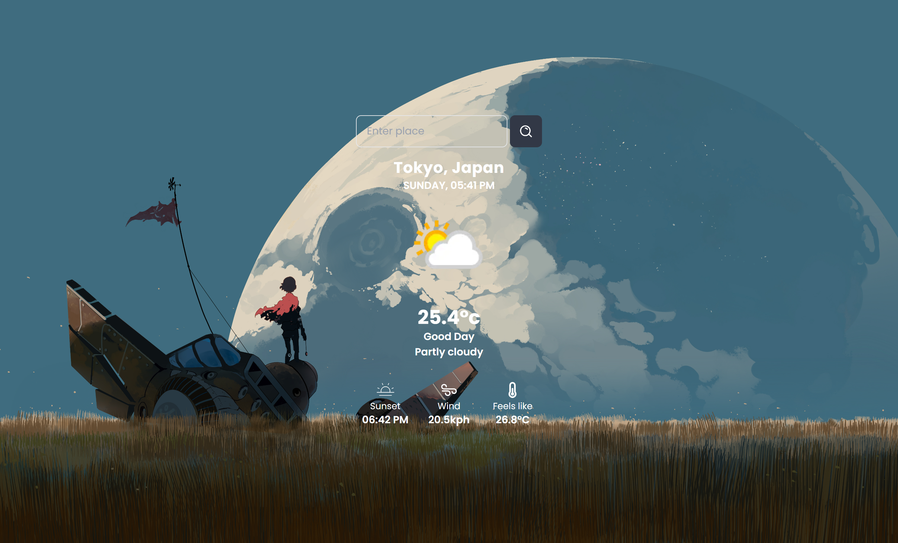

<p align="center">
  
</p>

# SkyCast!

* This is a simple and user-friendly weather search app that lets users quickly check the current weather and forecast for any location they type in.
* LIVE: <a href="https://skyCast-sether31.vercel.app">SkyCast Preview</a>

## How It Works

- You type a city or place name into the search bar.
- When you click the Search button, the app fetches weather data from the WeatherAPI.
- It shows the current temperature, weather conditions (like sunny or rainy), how it feels outside, wind speed, sunset time, and more.
- The app also displays a friendly greeting — “Good Day” if it’s daytime or “Good Night” if it’s nighttime — along with a matching background image to set the mood.
- If you enter an invalid location or there’s a problem with the API, the app will politely show an error message so you know to try again.
- While the data is loading, a loading screen appears to let you know it’s working on your request.


## Features
1. **Real-time weather info with temperature in Celsius.**
2. **Automatic background change based on day or night.**
3. **Error handling with clear messages.**
4. **Loading animation to improve user experience.**
5. **Clean and easy-to-read display of location and local time.**

#### This app is perfect for anyone who wants quick weather updates without hassle. Just type your city and get instant weather info with a friendly vibe!

## Installation

#### 1. **Clone the repository:**
```cmd
git clone https://github.com/sether31/skyCast.git
```

## Technologies Used
#### Frontend
  + HTML & CSS
  + Tailwind CSS (CSS Framework)
  + JavaScript (ES6+)
  + WeatherAPI 